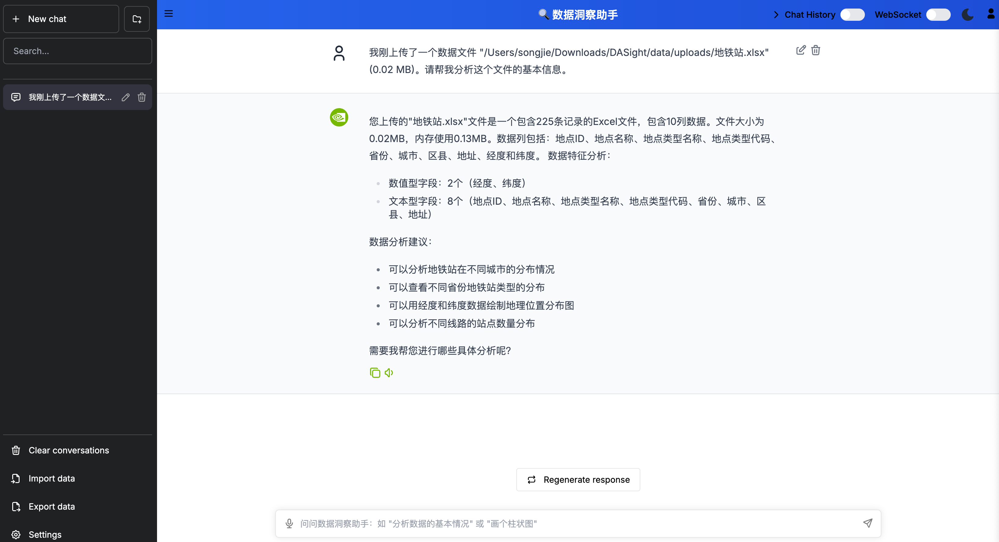

# 数据洞察助手 (DASight)

> 🔍 **智能数据分析平台** - 基于NVIDIA NeMo Agent Toolkit构建的专业数据洞察助手，让数据分析变得简单智能



## 🎯 项目简介

数据洞察助手(DASight)是基于NVIDIA官方NeMo Agent Toolkit构建的智能数据分析平台。项目充分利用NVIDIA AIQ技术栈，集成先进的数据探索和可视化服务，实现CSV/Excel文件的自动分析、智能洞察和交互式可视化展示。

### ✨ 核心特性

- 📊 **智能数据分析**: 自动识别数据模式，生成深度洞察报告
- 📁 **文件处理**: 支持CSV/Excel文件上传，自动解析和预览
- 💬 **对话式查询**: 通过自然语言与数据交互，获得精准分析结果
- 📈 **智能可视化**: 基于数据特征自动推荐合适的图表类型
- 🤖 **AI驱动**: 基于NVIDIA NeMo Agent Toolkit的强大AI能力
- 🎨 **现代界面**: 响应式设计，支持多设备访问
- 🚀 **一键部署**: 跨平台安装脚本，快速环境配置

## 🏗️ 技术架构

### 前端
- **框架**: Next.js 14 + TypeScript
- **UI库**: 官方[NeMo-Agent-Toolkit-UI](https://github.com/NVIDIA/NeMo-Agent-Toolkit-UI)
- **特性**: 文件上传、数据预览、图表展示、实时对话

### 后端技术
- **核心**: NVIDIA NeMo Agent Toolkit (AIQ)
- **数据处理**: 集成多个AI工具包 (aiqtoolkit_crewai, aiqtoolkit_langchain等)
- **API兼容**: 支持OpenAI兼容接口，灵活对接各种大语言模型

### 模型支持
- **默认**: Qwen模型
- **兼容**: 任何OpenAI格式的API
- **自定义**: 用户可配置API密钥、模型名称、base_url
### 数据处理服务
- **数据探索**: @reading-plus-ai/mcp-server-data-exploration
- **可视化**: @hustcc/mcp-echarts (基于ECharts)
- **文件处理**: 支持多种格式和编码自动检测

## 🚀 快速开始

### 📋 环境要求

- **Python**: 3.12+
- **Node.js**: 18+
- **Git**: 最新版本
- **操作系统**: Windows 10+/macOS 10.15+/Ubuntu 20.04+

### ⚡ 一键安装

#### 克隆项目
```bash
git clone https://github.com/juforg/DASight.git
cd DASight
```

### 🔑 配置API密钥

#### 1. 大模型API密钥

编辑配置文件 `configs/hackathon_config.yml`：

```yaml
llms:
  # 默认使用Bailian API (用户可修改)
  default_llm:
    _type: openai
    model_name: "qwen-plus"
    api_key: "Your API Key"
    base_url: "https://dashscope.aliyuncs.com/compatible-mode/v1"
    temperature: 0.7
    max_tokens: 2048
```

**支持的API提供商**：
- **阿里云百炼平台**: [获取Qwen API密钥](https://bailian.console.aliyun.com/)
- **其他**: 任何OpenAI兼容的API服务

#### Linux/macOS
```bash
# 运行安装脚本
chmod +x install.sh
./install.sh
```

#### Windows
```powershell
# 运行安装脚本
install.bat
```


### 🎮 启动系统

```bash
# 启动服务
cd NeMo-Agent-Toolkit
./start.sh

# 停止服务
./stop.sh
```

### 🌐 访问地址

- **数据洞察界面**: http://localhost:3000
- **API文档**: http://localhost:8001/docs
- **健康检查**: http://localhost:8001/health

## 📊 主要功能

### 1. 文件上传与解析
- 支持CSV、Excel格式文件上传
- 自动检测文件编码和分隔符
- 智能识别数据类型和表头
- 提供数据预览和基础校验

### 2. 自动数据探索
- 生成数据摘要和统计报告
- 识别数据分布特征和异常值
- 自动计算基本统计量
- 分析字段相关性和关联度

### 3. 对话式数据查询
- 自然语言查询数据
- 智能理解查询意图
- 支持复杂的条件筛选和计算
- 自动生成分析结论和建议

### 4. 智能可视化展示
- 根据数据特征推荐图表类型
- 支持柱状图、折线图、饼图、散点图等
- 提供交互式图表操作
- 支持自定义图表样式和参数

### 5. 高级分析功能
- 数据清洗和预处理
- 趋势分析和模式识别
- 支持自定义分析任务
- 分析历史保存和导出

## 🧪 使用示例

### 数据上传分析
```
1. 点击"上传文件"按钮，选择CSV或Excel文件
2. 系统自动解析并显示数据预览
3. 点击"开始分析"，AI自动生成数据洞察报告
```

### 对话式查询
```
用户: 帮我分析一下销售数据的月度趋势
AI: 根据您的销售数据，我发现以下趋势：
    - 3-5月销售额呈稳定增长，平均增长率15%
    - 6月出现峰值，销售额达到45万
    - 建议重点关注6月的成功因素...
    [同时生成对应的趋势图表]
```

### 智能可视化
```
用户: 把各产品类别的销售占比用图表展示
AI: 我为您生成了饼图，显示各产品类别占比：
    - 电子产品：35%
    - 服装：28%  
    - 家居：22%
    - 其他：15%
    [展示交互式饼图]
```

## 📁 项目结构

```
DASight/
├── NeMo-Agent-Toolkit/         # NVIDIA NeMo Agent Toolkit核心
├── external/                   # 外部模块
│   └── aiqtoolkit-opensource-ui/  # 前端UI界面
├── configs/                    # 配置文件
│   └── hackathon_config.yml   # 主配置文件
├── src/                        # 源代码
│   └── aiq/                    # AIQ核心逻辑
├── data/                       # 数据目录 (运行时创建)
│   ├── uploads/                # 上传文件存储
│   └── processed/              # 处理后数据
├── install.sh                  # Linux/macOS安装脚本
├── install.bat                 # Windows安装脚本
├── start.sh                    # 启动脚本
├── stop.sh                     # 停止脚本
├── MODIFICATION_PLAN.md        # 项目修改计划
└── README.md                   # 项目说明文档
```

## ⚙️ 高级配置

### 自定义数据处理工具

在配置文件中添加新的数据分析工具：

```yaml
functions:
  custom_analysis:
    _type: data_analysis
    description: "自定义数据分析工具"
    parameters:
      analysis_type: "regression"
      confidence_level: 0.95
```

### 可视化配置

```yaml
workflow:
  _type: react_agent
  tool_names:
    - internet_search
    - current_datetime
    - your_custom_tool
  llm_name: default_llm
  verbose: true
```

### 调试模式

```bash
# 启用详细日志
aiq serve --config_file configs/hackathon_config.yml --verbose
```

## 🐛 故障排除

### 常见问题

#### 1. 端口占用
```bash
# 检查端口占用
netstat -tlnp | grep :8001

# 使用不同端口
aiq serve --port 8002
```

#### 2. API密钥错误
- 检查 `configs/hackathon_config.yml` 中的API密钥配置
- 确认环境变量 `TAVILY_API_KEY` 已正确设置
- 验证API密钥的有效性和权限

#### 3. 依赖安装失败
```bash
# 清理缓存重新安装
uv cache clean
uv pip install -e . --force-reinstall
```

#### 4. 前端无法连接后端
- 检查后端是否正常启动（访问 http://localhost:8001/health）
- 确认端口配置正确
- 检查防火墙设置

### 日志查看

```bash
# 查看后端日志
tail -f logs/aiq.log

# 查看前端日志
cd external/aiqtoolkit-opensource-ui
npm run dev -- --verbose
```
#### 1. 文件上传失败
- 检查文件格式是否为CSV或Excel
- 确认文件大小不超过100MB
- 检查文件编码是否正确

#### 2. 数据解析错误
- 确认CSV文件分隔符设置
- 检查Excel文件是否损坏
- 验证数据格式的一致性

#### 3. 图表显示异常
- 检查数据类型是否匹配图表要求
- 确认数据量不超过可视化限制
- 查看浏览器控制台错误信息

#### 4. API连接问题
- 验证API密钥的有效性
- 检查网络连接状态
- 确认API服务正常运行

### 性能优化建议

- 对于大型数据集，建议使用数据抽样功能
- 定期清理临时文件和缓存
- 合理设置内存和并发限制


## 📚 相关资源

## 🎯 应用场景

### 商业智能分析
- 销售数据分析和趋势预测
- 客户行为模式挖掘
- 市场竞争分析

### 科研数据处理  
- 实验数据统计分析
- 观测数据可视化
- 研究结果展示

### 教育培训
- 数据分析教学案例
- 学生实践项目
- 统计学习辅助

### 金融分析
- 投资组合分析
- 风险评估建模
- 市场数据监控

### 医疗健康
- 患者数据分析
- 临床试验结果统计
- 健康趋势监测
  
## 📚 相关资源

### 官方文档
- [NVIDIA NeMo Agent Toolkit](https://github.com/NVIDIA/NeMo-Agent-Toolkit)
- [官方文档](https://docs.nvidia.com/nemo-agent-toolkit/)
- [NeMo Agent Toolkit UI](https://github.com/NVIDIA/NeMo-Agent-Toolkit-UI)

### API文档
- [Tavily API文档](https://docs.tavily.com/)
- [阿里云百炼平台](https://bailian.console.aliyun.com/?tab=doc#/doc)
- [OpenAI API文档](https://platform.openai.com/docs/)
- [数据探索MCP服务](https://github.com/reading-plus-ai/mcp-server-data-exploration)
  
### 学习资源
- [AI Agent开发指南](https://docs.nvidia.com/nemo-agent-toolkit/user-guide/)
- [React Agent工作流](https://docs.nvidia.com/nemo-agent-toolkit/workflows/react-agent/)
- [MCP协议文档](https://docs.nvidia.com/nemo-agent-toolkit/mcp/)

## 🔄 项目发展

本项目正在持续开发中，当前处于demo阶段。根据[修改计划](MODIFICATION_PLAN.md)，我们将逐步实现：

- ✅ **当前版本**: 基础对话机器人框架
- 🚧 **开发中**: 文件上传和数据解析功能  
- 📋 **计划中**: 智能数据分析和可视化功能
- 🔮 **未来**: 高级分析和机器学习功能

## 💡 贡献指南

我们欢迎社区贡献！请查看[贡献指南](CONTRIBUTING.md)了解如何参与项目开发。

### 开发环境设置
```bash
# 开发模式启动
npm run dev          # 前端开发服务器
python -m aiq serve  # 后端调试模式
```

---

**🔍 让数据分析变得简单智能！**

> 数据洞察助手致力于降低数据分析门槛，让每个人都能轻松获得有价值的数据洞察。基于NVIDIA强大的AI技术，我们为用户提供专业级的数据分析体验。

